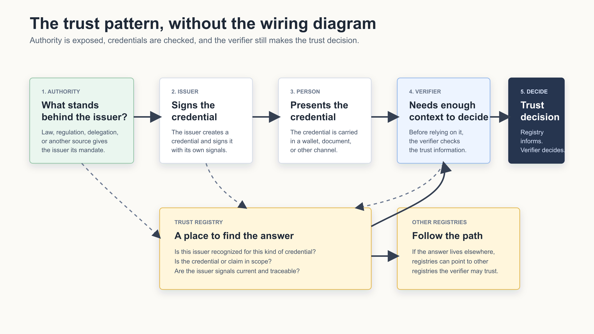

# Trust Registries Track 1 — Policy, Taxonomy & Scope. Onboarding & Governance

Status: Working draft for GDC Trust Registry Task Force discussion

Part of the Global Digital Collaboration Trust Registry Task Force. This is the track's defining document: the scope below sets the boundaries, and everything else — starting with the [Issuer Onboarding & Governance Framework v0.1](issuer-onboarding-and-governance-v0.1.md) — is worked within them.

## Scope

This work is scoped to two sides of the same exchange: **what can an authority do to expose its trust information digitally**, and **what are its options for doing so?** And on the other side: **how do relying parties use that information to make their own trust decisions?**

We are not designing new authorities, new governance bodies, or new vetting processes. The authority already exists — in legislation, regulation, or delegation. The work is limited to how that existing authority makes itself, and the issuers it recognizes, discoverable and checkable in digital form.

An authority's options include, at minimum:

- **Operate its own registry.** The authority publishes its own trust registry and is directly accountable for its answers.
- **Designate or participate in a shared registry service.** The authority supplies its information to a service operated on its behalf (as member states do with ICAO PKD, North American MDL issuers do with AAMVA, or EU member states do with the EU Trust List). The service operator provides the plumbing; the authority remains the authority.
- **Point to its basis of authority.** The authority signals how it holds its authority — for example, by referencing the legislation it operates under — rather than proving eligibility to anyone.

On the consuming side, a party using a registry needs answers to two basic questions:

1. **Is this issuer authoritative for issuing that kind of credential?** Not just "is the issuer listed," but is it recognized for this credential type, in this jurisdiction, right now.
2. **Does this registry recognize another trust registry?** A registry can acknowledge other registries as trustworthy sources for questions outside its own scope.

The second question is what makes the model scale. No single registry can answer for the whole world, and no single root will be accepted by everyone. When registries can recognize each other, a relying party can start from any credential and traverse the connections — registry to registry — until it reaches an authority it trusts. That traversal is what turns isolated lists into a web of registries: a graph, not a hierarchy.

Whichever option an authority chooses, the same pattern repeats underneath:

1. A **verifiable digital credential**, signed by an issuer.
2. An **anchoring to a trust registry**, where the issuer's authority can be checked: who recognized this issuer, for what, and is that recognition current?
3. A **trust decision made by the relying party itself.** The registry informs the decision; it never makes it. Whether to accept the credential remains the relying party's own policy call.

*The same pattern repeats across use cases: authority stands behind the issuer, the issuer signs the credential, the verifier checks trust information, and the verifier makes the trust decision.*

**The pattern is the work.** This track studies that pattern, and proves it using concrete examples drawn from government-issued personal identity credentials — driver's licenses, national ID cards, passports. The examples keep the work grounded; the pattern is what the deliverable describes. If a proposed feature or requirement does not serve one of these three steps, help an authority exercise one of the options above, or help a verifier/relying party answer one of the two questions, it is out of scope for v0.1.

**Other areas can certainly be worked.** Business identity and business credentials, education credentials, and other domains follow the same pattern — an issuer, an anchoring registry, a relying-party decision. They are not the September examples, but parallel work on them can and should continue against this same pattern; nothing in this scope blocks it. What this scope prevents is the September deliverable absorbing that work before the pattern is proven on the personal identity examples.

## Work Items

### Policy, Taxonomy & Scope

Establishing a "Shared Vocabulary"; drafting the Requirements & Scope Document; defining trust registry policy elements.

- Finalize this scope statement with the co-leads, confirming what is explicitly in and out of scope for the September deliverable.
- Build the shared vocabulary for the terms the scope depends on: verifiable digital credential, issuer, authority, trust registry, relying party, and recognized vs. vetted. Working definitions are seeded in the framework's [Shared Vocabulary](issuer-onboarding-and-governance-v0.1.md#shared-vocabulary) section.
- Define the two relying-party questions precisely as policy elements: what "authoritative for a kind of credential" means (type, claims, jurisdiction, currency), and what it means for one registry to recognize another.
- Develop the taxonomy of authority exposure options: operate a registry, participate in a shared registry service, or point to a basis of authority.
- Apply the scope test to incoming proposals so the September deliverable stays focused on the pattern, proven through the personal identity credential examples — while parallel work in other domains continues against the same pattern.

Out of scope (noted, not ours to define):

- **Wire formats, protocols, and data models** for asking and answering the two relying-party questions. We define what the questions mean as policy; how they are asked and answered technically belongs to the technical track.
- **A universal taxonomy of credential types or issuers.** The shared vocabulary covers only the terms the scope depends on; cataloguing every credential domain is someone else's encyclopedia.
- **Assurance-level rankings or comparisons across authorities.** Which authorities a relying party honors, and at what assurance, is its own policy call — ranking sovereigns would cross the sovereignty boundary.
- **Wallet governance and relying-party/verifier registration policy.** Both are real (wallets act as policy enforcement points; cross-border verifier registration is a known blocker) — noted and parked in [Later Phases](https://github.com/ayraforum/gdc-trtf-onboarding-and-governance/blob/main/later-phases/README.md).

### Onboarding & Governance

Defines principles for issuer onboarding and governance through recognized trust registries, including issuer authority, credential scope, status, conformance evidence, and privacy/security models that support jurisdictional accountability and cross-ecosystem reliance.

- Describe the onboarding path for each authority option — a sovereign lighting up its own registry, or participating in a shared service such as AAMVA, ICAO PKD, or the EU Trust Lists — keeping sovereign recognition (recorded, not approved) distinct from registrar-vetted onboarding for delegated issuers.
- Work the pattern through the three concrete examples — driver's license, national ID card, passport — including how a credential signals which trust registry it is anchored to.

Out of scope (noted, not ours to define):

- **Registry entry lifecycle governance.** How a registry adds, updates, suspends, revokes, and keeps its entries current. Authorities and registry operators do this as a matter of course in running their registries; we note that these functions must exist, and go no further.
- **Registry-to-registry recognition decisions.** How a registry decides which other registries to recognize, and how that recognition is granted or withdrawn. A consideration for any registry operator, not ours to govern — we only ask that the recognition be visible to relying parties.
